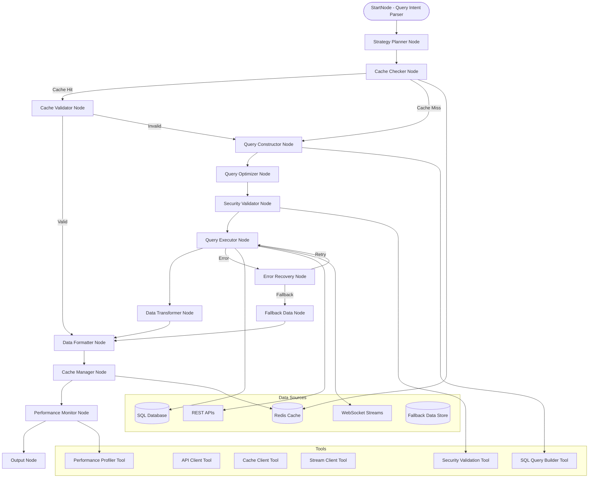
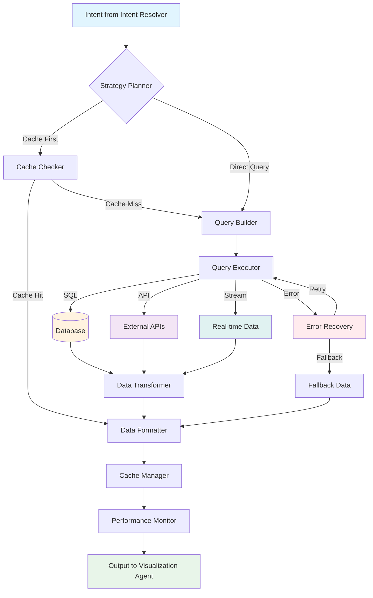

# Query Engine Agent

## 🌟 Problem Statement

Enterprise analytics dashboards require seamless data retrieval from multiple heterogeneous sources (SQL databases, REST APIs, real-time feeds, cached datasets) with varying query patterns, performance requirements, and security constraints. Manual query construction for 50+ widget types across different data sources results in inconsistent data access patterns, poor performance optimization, security vulnerabilities, and brittle error handling.

The Query Engine Agent will serve as the centralized data orchestration layer that transforms structured visualization intents into optimized, secure, and reliable data queries while maintaining consistent performance across the entire analytics platform.

---

## 💡 Agent Objective

* **Transform structured intents** into executable queries across multiple data sources
* **Optimize query performance** through intelligent caching, query optimization, and resource management
* **Ensure data security** through query validation, access controls, and sanitization
* **Provide reliable execution** with retry logic, fallback strategies, and graceful error handling
* **Abstract data complexity** from visualization components through consistent output formatting
* **Enable scalable analytics** by supporting both real-time and batch data processing

---

## 📂 Scope of Agent

### ✅ The Agent WILL:

1. **Multi-Source Query Strategy** - Intelligently route queries to optimal data sources (cache, SQL, API, real-time streams)
2. **SQL Query Generation** - Construct performant SQL queries from structured visualization intents
3. **API Query Construction** - Build REST/GraphQL queries for external enterprise systems
4. **Real-Time Data Integration** - Handle WebSocket connections and streaming data for live widgets
5. **Query Optimization** - Apply performance optimizations (LIMIT clauses, indexing hints, query rewriting)
6. **Security Validation** - Prevent SQL injection, enforce row-level security, validate access permissions
7. **Execution Management** - Execute queries with retry logic, timeout handling, and connection pooling
8. **Data Transformation** - Format raw query results into standardized widget-compatible structures
9. **Intelligent Caching** - Implement multi-level caching with TTL management and cache invalidation
10. **Performance Monitoring** - Track query execution times, cache hit rates, and resource utilization
11. **Error Recovery** - Provide fallback data sources and graceful degradation strategies
12. **Audit Logging** - Log all query executions for compliance and debugging

### ❌ The Agent WILL NOT:

* Modify database schemas, create tables, or alter data structures
* Perform complex business logic calculations (delegated to data processors)
* Handle user authentication or session management (delegated to auth service)
* Generate visualization components or chart specifications (handled by Visualization Agent)
* Manage database connections directly (uses enterprise connection pool)
* Store sensitive data in persistent cache beyond session scope
* Perform data migrations or ETL processes
* Handle real-time alert generation (delegated to Alert Handler Agent)

---

## 📈 Fully Dynamic Execution Path

The Query Engine Agent's execution path dynamically adapts based on the **data source availability, query complexity, and performance requirements**. The **Strategy Planner** determines the optimal execution route, potentially utilizing multiple data sources and caching layers simultaneously.

### Example Scenarios:

| Intent Type | Dynamic Execution Path |
|-------------|------------------------|
| **Real-time employee metrics** | Strategy Planner ➡ Cache Checker ➡ Real-time Stream Connector ➡ Data Formatter ➡ Output |
| **Historical department analytics** | Strategy Planner ➡ Cache Checker ➡ SQL Query Constructor ➡ Query Optimizer ➡ SQL Executor ➡ Data Formatter ➡ Cache Manager ➡ Output |
| **External API integration** | Strategy Planner ➡ API Query Constructor ➡ Security Validator ➡ API Executor ➡ Data Transformer ➡ Output |
| **Complex multi-source query** | Strategy Planner ➡ SQL Executor + API Executor (parallel) ➡ Data Merger ➡ Data Formatter ➡ Output |
| **Cached dashboard refresh** | Strategy Planner ➡ Cache Manager ➡ Cache Validator ➡ Output (cache hit) OR Full Query Path (cache miss) |

The agent intelligently **short-circuits** execution paths based on data availability, cache validity, and performance thresholds.

---

## ⚙️ LangGraph Architecture



### States

| State Name | Purpose | Schema |
|------------|---------|--------|
| `QueryIntent` | Structured intent from Intent Resolver | `{chart, metric, dimension, filters, metadata}` |
| `QueryStrategy` | Execution strategy and data source routing | `{primary_source, fallback_sources, cache_strategy, optimization_hints}` |
| `CacheContext` | Cache validation and management state | `{cache_key, ttl, validity, hit_rate}` |
| `QueryContext` | Generated queries and execution plans | `{sql_query, api_endpoints, stream_subscriptions, execution_plan}` |
| `ExecutionContext` | Query execution results and metadata | `{raw_data, execution_time, affected_rows, data_source}` |
| `DataContext` | Transformed and formatted data | `{formatted_data, data_schema, widget_compatibility}` |
| `PerformanceContext` | Performance metrics and monitoring | `{query_time, cache_hit_rate, memory_usage, optimization_suggestions}` |

---

### Nodes

| Node Name | Functionality | Input | Output |
|-----------|---------------|-------|--------|
| **StartNode** | Parse and validate incoming query intents | Raw intent from Intent Resolver | Validated QueryIntent state |
| **Strategy Planner Node** | Determine optimal data source and execution strategy | QueryIntent | QueryStrategy + routing decisions |
| **Cache Checker Node** | Check cache availability and validity | QueryStrategy | Cache hit/miss + CacheContext |
| **Cache Validator Node** | Validate cached data freshness and relevance | CacheContext | Valid cached data OR cache invalidation |
| **Query Constructor Node** | Build executable queries (SQL, API, etc.) | QueryStrategy + QueryIntent | QueryContext with executable queries |
| **Query Optimizer Node** | Apply performance optimizations to queries | QueryContext | Optimized QueryContext |
| **Security Validator Node** | Validate queries for security compliance | QueryContext | Security-approved QueryContext |
| **Query Executor Node** | Execute queries against data sources | QueryContext | ExecutionContext with raw results |
| **Data Transformer Node** | Transform raw data into standardized format | ExecutionContext | Structured data objects |
| **Data Formatter Node** | Format data for specific widget requirements | Structured data | Widget-compatible DataContext |
| **Cache Manager Node** | Update cache with new data and manage TTL | DataContext | Updated cache state |
| **Performance Monitor Node** | Track and log performance metrics | All execution data | PerformanceContext + audit logs |
| **Error Recovery Node** | Handle failures with retry logic and fallbacks | Error context | Recovery strategy OR fallback data |
| **Fallback Data Node** | Provide fallback data when primary sources fail | Error context | Fallback DataContext |
| **Output Node** | Return formatted data to Visualization Agent | DataContext + metadata | Standardized agent output |

---

## 📊 Query Engine Agent Flow

The following diagram illustrates the complete data flow through the Query Engine Agent:



### Flow Description:
1. **Intent Processing**: Receives structured intent from Intent Resolver Agent
2. **Strategy Planning**: Determines optimal execution path (cache vs direct query)
3. **Cache Management**: Checks for existing cached results to avoid redundant queries
4. **Query Execution**: Builds and executes SQL queries, API calls, or stream connections
5. **Data Processing**: Transforms raw results into standardized widget-compatible format
6. **Performance Tracking**: Monitors execution metrics and updates cache for future requests
7. **Error Handling**: Provides fallback strategies and retry logic for failed operations

---

## 🛠️ Tools Required

| Tool Name | Purpose | Implementation Details |
|-----------|---------|----------------------|
| **SQL Query Builder Tool** | Construct SQL queries from structured intents | Uses query builder library (e.g., Knex.js) with template system |
| **API Client Tool** | Make HTTP requests to external APIs | Axios-based client with retry logic, timeout, and authentication |
| **Cache Client Tool** | Interact with Redis cache layer | Redis client with connection pooling and cluster support |
| **Stream Client Tool** | Manage WebSocket connections for real-time data | WebSocket client with reconnection logic and message queuing |
| **Security Validation Tool** | Validate queries for security compliance | SQL injection detection, query whitelisting, access control validation |
| **Performance Profiler Tool** | Monitor and profile query execution | Query execution timing, memory usage tracking, bottleneck detection |
| **Data Schema Validator** | Validate data against widget schema requirements | JSON schema validation for widget data compatibility |
| **Connection Pool Manager** | Manage database connections efficiently | Connection pooling with health checks and load balancing |
| **Audit Logger Tool** | Log query executions for compliance | Structured logging with query metadata, user context, and performance metrics |

---

## 📊 Core Analytics Functions

### Query Optimization Strategies

* **Query Rewriting** - Transform complex queries into more efficient equivalents
* **Index Utilization** - Add index hints for optimal query execution plans  
* **Result Set Limiting** - Apply intelligent LIMIT clauses based on widget requirements
* **Query Parallelization** - Split complex queries into parallel executable components
* **Predicate Pushdown** - Move filters closer to data source for reduced data transfer

### Caching Architecture

* **Multi-Level Caching** - L1 (in-memory), L2 (Redis), L3 (persistent cache)
* **TTL Management** - Dynamic TTL based on data volatility and update frequency
* **Cache Invalidation** - Event-driven invalidation with dependency tracking
* **Cache Warming** - Proactive cache population for predictable queries
* **Cache Analytics** - Hit rate monitoring and optimization recommendations

### Performance Monitoring

* **Query Performance Tracking** - Execution time, resource usage, bottleneck identification
* **Data Source Health Monitoring** - Connection status, response times, error rates
* **Cache Performance Analysis** - Hit rates, memory usage, eviction patterns
* **Predictive Performance Optimization** - ML-based query performance predictions

---

## 🧑‍💼 Agent Persona & Tone

| Attribute | Description |
|-----------|-------------|
| **Persona** | Analytical Database Architect - Expert in query optimization and data orchestration |
| **Tone** | Technical, precision-focused, performance-oriented with clear diagnostic information |
| **Contextual Awareness** | Understands data source capabilities, performance characteristics, and business priorities |
| **Proactivity** | Anticipates performance issues and proactively optimizes query execution strategies |

### Tone Examples

* **Performance Alert (Critical):**
  > *"PERFORMANCE DEGRADATION: Employee analytics query executing in 2.3s (SLA: 500ms). Recommending index creation on department_id column and implementing query result caching."*

* **Cache Optimization (Informational):**
  > *"CACHE EFFICIENCY: 89% hit rate on workload queries. Extending TTL for department-level aggregations from 5m to 15m based on update frequency analysis."*

* **Error Recovery (Warning):**
  > *"DATA SOURCE FAILOVER: Primary employee DB unavailable. Executing query against read replica with 30s data lag. User notified of delayed data status."*

---

## 📏 Output (Hand-off to Visualization Agent)

The Query Engine Agent returns comprehensive data packages optimized for widget consumption:

### Standard Output Format

```json
{
  "agent_id": "query_engine",
  "timestamp": "2025-01-15T10:30:00Z",
  "data": {
    "records": [
      {
        "department": "Engineering",
        "burnout_risk_score": 7.2,
        "employee_count": 45,
        "trend": "increasing"
      },
      {
        "department": "Sales", 
        "burnout_risk_score": 5.8,
        "employee_count": 32,
        "trend": "stable"
      }
    ],
    "schema": {
      "primary_key": "department",
      "metrics": ["burnout_risk_score", "employee_count"],
      "dimensions": ["department"],
      "data_types": {
        "burnout_risk_score": "float",
        "employee_count": "integer",
        "trend": "string"
      }
    },
    "metadata": {
      "total_records": 156,
      "filtered_records": 2,
      "execution_time_ms": 45,
      "data_source": "employee_analytics_db",
      "cache_status": "miss",
      "data_freshness": "2025-01-15T10:29:30Z"
    }
  },
  "query_info": {
    "executed_queries": [
      {
        "type": "sql",
        "query": "SELECT department, AVG(burnout_risk_score) as burnout_risk_score, COUNT(*) as employee_count FROM employee_analytics WHERE date_range >= '2024-12-15' GROUP BY department ORDER BY burnout_risk_score DESC",
        "execution_time_ms": 43,
        "affected_rows": 156
      }
    ],
    "optimization_applied": [
      "index_hint_department",
      "result_limit_applied",
      "predicate_pushdown"
    ],
    "cache_strategy": {
      "cache_key": "emp_burnout_by_dept_30d",
      "ttl_seconds": 300,
      "cache_level": "L2_redis"
    }
  },
  "performance": {
    "query_complexity": "medium",
    "resource_usage": {
      "cpu_ms": 12,
      "memory_kb": 256,
      "network_kb": 8.4
    },
    "optimization_suggestions": [
      "Consider materialized view for department-level aggregations",
      "Cache candidate: 85% query pattern match"
    ]
  },
  "status": "success",
  "next_agent": "visualization_agent"
}
```

### Error Output Format

```json
{
  "agent_id": "query_engine",
  "timestamp": "2025-01-15T10:30:00Z",
  "status": "error",
  "error": {
    "error_type": "data_source_timeout",
    "error_code": "QE_001",
    "message": "Primary database connection timeout after 30s",
    "recovery_action": "fallback_to_replica",
    "user_message": "Data may be delayed due to system maintenance"
  },
  "fallback_data": {
    "records": [],
    "metadata": {
      "data_source": "cached_fallback",
      "data_age_hours": 2,
      "confidence": "medium"
    }
  },
  "next_agent": "error_handler"
}
```

### Widget-Specific Output Formats

```json
{
  "widget_formats": {
    "chart_widgets": {
      "data": "records array optimized for Recharts",
      "x_axis": "dimension field name",
      "y_axis": "metric field name", 
      "series": "grouped data for multi-series charts"
    },
    "table_widgets": {
      "columns": "column definitions with types and formatting",
      "rows": "paginated data with sorting metadata",
      "total_count": "total records for pagination"
    },
    "kpi_widgets": {
      "value": "single metric value",
      "trend": "trend direction and percentage change",
      "benchmark": "comparison value or target"
    }
  }
}
```

---

## 🔄 Integration Patterns

### With Analytics Dashboard Widget System

The Query Engine Agent integrates seamlessly with the existing 50+ widget architecture:

```typescript
// Widget data fetching pattern
const useWidgetData = (widgetIntent: WidgetIntent) => {
  return useQuery({
    queryKey: ['widget-data', widgetIntent],
    queryFn: async () => {
      const response = await queryEngineAgent.execute(widgetIntent);
      return response.data;
    },
    enabled: !!widgetIntent,
    staleTime: 30000, // 30 seconds
    refetchInterval: response => {
      // Dynamic refetch based on data freshness
      return response?.metadata?.ttl_ms || 60000;
    }
  });
};
```

### Real-Time Data Integration

```typescript
// WebSocket integration for live widgets
const realtimeDataStream = {
  subscribe: (widgetId: string, callback: DataUpdateCallback) => {
    queryEngineAgent.subscribeToRealtimeUpdates(widgetId, callback);
  },
  unsubscribe: (widgetId: string) => {
    queryEngineAgent.unsubscribeFromRealtimeUpdates(widgetId);
  }
};
```

This Query Engine Agent specification provides a comprehensive foundation for building a robust, scalable, and secure data orchestration layer that powers the entire analytics dashboard ecosystem while maintaining high performance and reliability standards.